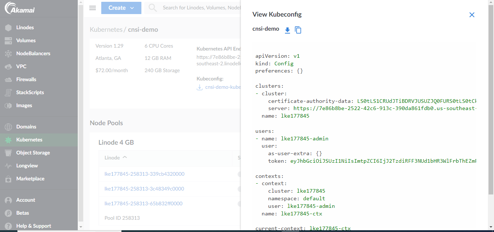
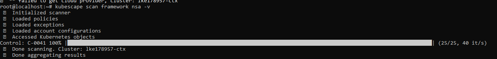
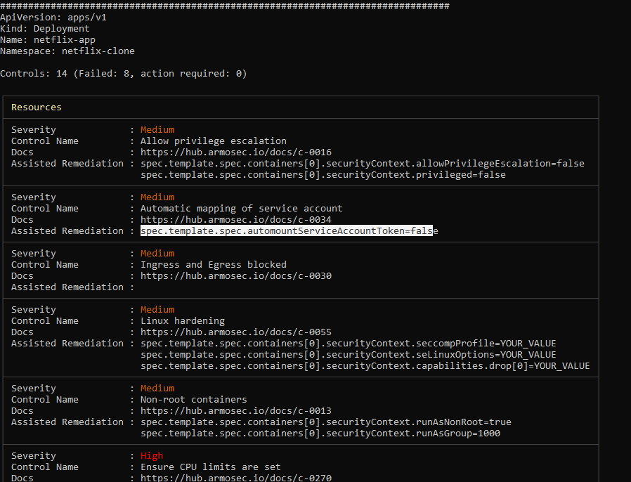

# Creating a Kubernetes Cluster on Linode and Performing Security Scanning with KubeScape

## Introduction
This documentation outlines the process of creating a Kubernetes cluster on Linode and conducting security scanning using KubeScape. The document assumes familiarity with Linode, Kubernetes basics, and Docker containers. Kubescape can also work with other cloud managed kubernetes clusters i.e. GKE, EKS, AKS.

### Prerequisites
- Linode account
- Basic understanding of Kubernetes


## Step 1: Creating a Kubernetes Cluster on Linode
1. Log in to your Linode account.
2. Navigate to the Kubernetes section.
3. Click on "Create Cluster" to begin the process.
4. Choose your preferred region, node type, and Kubernetes version.
5. Configure additional settings such as node count, node pool size, and authentication method.
6. Review and confirm your settings.
7. Wait for the cluster creation process to complete.

## Step 2: Deploying an Application to the Kubernetes Cluster
1. Access your Kubernetes cluster using `kubectl` commands.
   

   copy the configuration as displayed in picture above, then create a ``kubeconfig.yaml`` file and paste it, run the following commands:
   ```
   nano kubeconfig.yaml
   ```

   ```
   export KUBECONFIG=kubeconfig.yaml
   ```
   run this command blow to check if you are connected to the cluster
   ```
   kubectl get nodes
   ```
2. Deploy your application container to the cluster. For example:
   ```bash
   kubectl apply -f <path-to-your-application-yaml>
   ```
3. Verify that your application is running correctly using:

```bash
kubectl get pods
```
## Step 3: Using KubeScape for Security Scanning

KubeScape is a powerful tool for scanning Kubernetes clusters against various security frameworks. Below are the steps to use KubeScape:

1. **Install KubeScape on your local machine.** Follow the installation instructions provided in the [KubeScape repository](https://github.com/kubescape/kubescape/blob/master/docs/getting-started.md#run-your-first-scan).

2. **Choose the security framework.** Decide which security framework you want to use for scanning your cluster. Options include CIS benchmarks, NIST standards, etc.

3. **Run the KubeScape scan command.** Execute the following command, specifying the namespaces you want to include in the scan:

    ```bash
    kubescape scan --namespace <namespace> --framework <security-framework>
    ```

    Replace `<namespace>` with the namespace of your deployed application and `<security-framework>` with the desired security standard i.e. nsa, mitre, etc.
   

   

5. **Analyze the scan results.** Review the output provided by KubeScape. Address any security issues or vulnerabilities discovered during the scan.

### Conclusion

In this documentation, you learned how to create a Kubernetes cluster on Linode, deploy an application container, and perform security scanning using KubeScape. Regular security scans are crucial to maintaining the integrity and safety of your Kubernetes environment.

   


